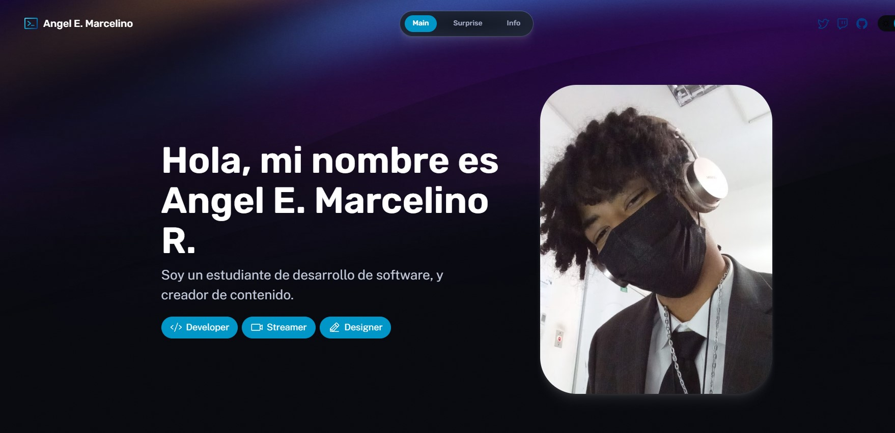

# Info

En este repositorio, se presentara la Tarea #1 del la asignatura Programacion Web impartida por el profesor Raydelto Hernández Perera.

Este Projecto fue elaborado en [ASTRO](https://astro.build/) Usando Los lenguajes HMTL, CSS y JS.

Creado y desarrollado por Angel Enrique Marcelino Rosario (2021-0451)
